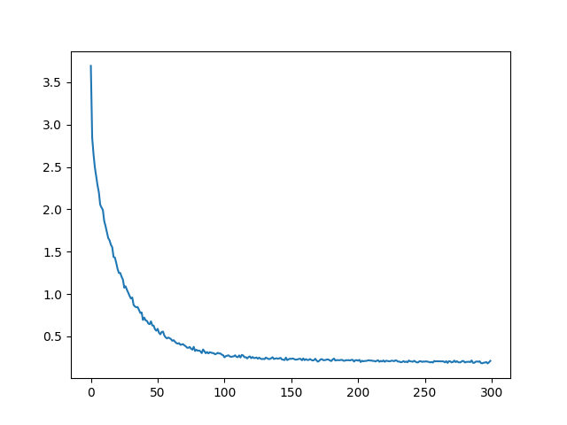

# Seq2seqTranslation

# 1 seq2seq模型架构:

# 2 seq2seq模型架构分析:
* 从图中可知, seq2seq模型架构, 包括两部分分别是encoder(编码器)和decoder(解码器), 编码器和解码器的内部实现都使用了GRU模型, 这里它要完成的是一个中文到英文的翻译: 欢迎 来 北京 --> welcome to BeiJing. 编码器首先处理中文输入"欢迎 来 北京", 通过GRU模型获得每个时间步的输出张量，最后将它们拼接成一个中间语义张量c, 接着解码器将使用这个中间语义张量c以及每一个时间步的隐层张量, 逐个生成对应的翻译语言.

# 3 翻译数据集:

* 下载地址: https://download.pytorch.org/tutorial/data.zip
* 数据文件预览:
- data/
- eng-fra.txt

# 4 基于GRU的seq2seq模型架构实现翻译的过程:

* 第一步: 导入必备的工具包.
* 第二步: 对持久化文件中数据进行处理, 以满足模型训练要求.
* 第三步: 构建基于GRU的编码器和解码器.
* 第四步: 构建模型训练函数, 并进行训练.
* 第五步: 构建模型评估函数, 并进行测试以及Attention效果分析.

## 4.1 编码器结构图

## 4.2 解码器结构图

## 4.3 loss损失下降图

## 4.4 训练输出结果

